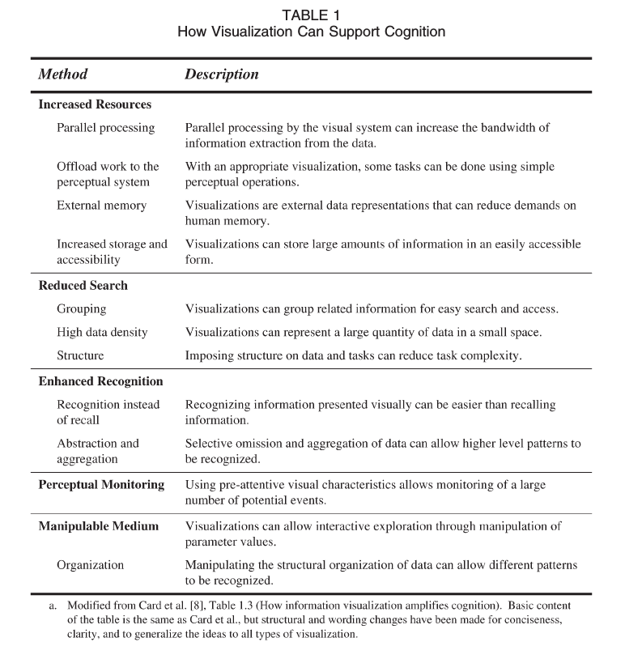

# LinkedCat+ — Cognitive Science Study

> The design of interactive computer systems is not only an art, but, at least aspirationally, a science. Well, not a science, actually, but rather a kind of joint computer-cognitive engineering, that is, science-based techniques to create interactive systems satisfying specified requirements. (Johnson, 2014)

## Table of Contents

- [LinkedCat+ — Cognitive Science Study](#linkedcat--cognitive-science-study)
    - [Table of Contents](#table-of-contents)
    - [Introduction](#introduction)
    - [Literature Review](#literature-review)
        - [Useful Readings](#useful-readings)
            - [Design of Everyday Things (Norman, 2016) (Original: 1988)](#design-of-everyday-things-norman-2016-original-1988)
            - [Human Factors in Visualization Research (Tory, 2004)](#human-factors-in-visualization-research-tory-2004)
            - [“Search, Show Context, Expand on Demand”: Supporting Large Graph Exploration with Degree-of-Interest (van Ham & Perer, 2009)](#search-show-context-expand-on-demand-supporting-large-graph-exploration-with-degree-of-interest-van-ham--perer-2009)
            - [Rules of Thumb (Munzner, 2014)](#rules-of-thumb-munzner-2014)
            - [Designing with the Mind in Mind: Simple guide to understanding user interface design guidelines (Johnson, 2014)](#designing-with-the-mind-in-mind-simple-guide-to-understanding-user-interface-design-guidelines-johnson-2014)
        - [Some questions that we should deal with before things get messy again](#some-questions-that-we-should-deal-with-before-things-get-messy-again)
    - [Designing with the mind in mind](#designing-with-the-mind-in-mind)
        - [Cognition](#cognition)
        - [Design](#design)
        - [Evaluation](#evaluation)
        - [Epistemology](#epistemology)
    - [A selection of approaches](#a-selection-of-approaches)
        - [Cognitive Load Theory](#cognitive-load-theory)
        - [A Cognition Framework for Information Visualization](#a-cognition-framework-for-information-visualization)
    - [Friends and Foes: A selective review of similar projects](#friends-and-foes-a-selective-review-of-similar-projects)
    - [Questions, Answers, and Recommendations](#questions-answers-and-recommendations)
        - [Specific questions from the beginning.](#specific-questions-from-the-beginning)
            - [The Limits of OKMaps](#the-limits-of-okmaps)
            - [How to deal with searches for broad topics such as "philosophy" or "mathematics"?](#how-to-deal-with-searches-for-broad-topics-such-as-%22philosophy%22-or-%22mathematics%22)
        - [Other questions that might be harder to answer](#other-questions-that-might-be-harder-to-answer)
            - [Is our processing time a problem?](#is-our-processing-time-a-problem)
            - [What is bad about lists?](#what-is-bad-about-lists)
            - [How to deal with the expectations and conceptual models of our users?](#how-to-deal-with-the-expectations-and-conceptual-models-of-our-users)
            - [Uncertainty & Dealing with expectations](#uncertainty--dealing-with-expectations)
            - [Are there cultural differences that Open Knowledge Maps should be taking into account?](#are-there-cultural-differences-that-open-knowledge-maps-should-be-taking-into-account)
            - [Implications how our memory works (from Johnson, 2014)](#implications-how-our-memory-works-from-johnson-2014)
            - [Some recommendations found across the literature](#some-recommendations-found-across-the-literature)
        - [Overall findings](#overall-findings)
    - [Conclusion](#conclusion)

## Introduction

1. How can we go beyond 100 articles?
    1. How many items should we show in a single view?
    2. How can we implement a mechanism to show nested maps?
    3. How to deal with corpora of >>100 articles (let's say 1000-5000)?
2. How to deal with searches for broad topics such as "philosophy" or "mathematics"?

The more important questions are probably the ones related to the mechanics of going beyond 100 articles.

Human-Computer Interaction is hard to get right. One reason for that is that a science of the human cognition is a lot harder to get right than physics. The one remaining approach to test assumptions and designs is then _usability testing_. But conducting tests is difficult and results are often hard to replicate. Thus, a recent alternative promoted by several disciplines coming from various directions is the adherence to _design rules_ often derived from cognitive psychology and the sciences of the mind.

## Literature Review

The literature review showed that several disciplines with slightly differing aims and goals could be approached to attempt to answer the questions. A rough breakdown is given below:

"Base disciplines"

- Cognitive Science
- Cognitive Psychology
- Psychology
- Design

More specific disciplines:

- Human Factors and Ergonomics
- Cognitive Ergonomics
- Human-Centered Design
- Human-Computer Interfaces
    - human perception, cognition, intelligence, decision-making and interactive techniques of visualization
- Knowledge Discovery and Data Mining
    - machine intelligence and data mining
    - automation
- Participatory design

What does OKMaps say about some these fields:

- [Human-centered design](https://openknowledgemaps.org/map/f10ed751f1280256e9ca699817f37f6c)
- [Human Computer Interface](https://openknowledgemaps.org/map/e6d2f9820138c34fb40664e4299fa06e)
- [Human Factors and Ergonomics](https://openknowledgemaps.org/map/b81b7f37905271c801bb78f898f806cb)

### Useful Readings

#### Design of Everyday Things (Norman, 2016) (Original: 1988)

One of the earliest comprehensive design guidelines that put the human/user at the center. Don Norman coined the term _human-centered design_. The 2016 version is a recent update of the original 1988 publication

#### Human Factors in Visualization Research (Tory, 2004)

#### “Search, Show Context, Expand on Demand”: Supporting Large Graph Exploration with Degree-of-Interest (van Ham & Perer, 2009)

The paper is particularly useful as it evaluates proposed algorithm with the use case of a legal citation network breaking it down into the following four questions/areas:

Importance
: Show me important cases related to my case of interest.

Reasoning
: Show me why this cited case is relevant to my case

Overview
: Show me an overview of this subfield

Relevance
: Show me if this case is what I think it is

#### Rules of Thumb (Munzner, 2014)

1. No Unjustified 3D
2. No Unjustified 2D
3. Eyes Beat Memory
4. Resolution over Immersion
5. Overview First, Zoom and Filter, Detail on Demand
6. Responsiveness Is Required
7. Get it Right in Black and White
8. Function First, Form Next

#### Designing with the Mind in Mind: Simple guide to understanding user interface design guidelines (Johnson, 2014)

Great modern update and summary of several previously existing user interface design guidelines. Makes clear that user interface guidelines are derived from cognitive psychology.

### Some questions that we should deal with before things get messy again

Having studied cognitive science I always get wary if anything is "cognitive". Thus, I would like to talk about terminology, vocabulary, and some concepts before leaving these questions behind diving into the mess of cognition and design.

- What is cognitive science?
- What is the difference between cognitive psychology and psychology?
- Why cognitive science and not simply psychology?

## Designing with the mind in mind

The general approach that has been distilled from the literature can be described in two stages. The first step is the acknowledgement of a new design paradigm that takes the human side into account. This method has been both developed and coined as _human-centered design_ by Dan Norman. **INSERT MAIN IDEAS** In the second step we can now focus on both aspects and specify the human-centeredness and design of our approach. What exactly does it mean to consider the human user of a particular design? What kind of designs are we talking about in the case of Open Knowledge Maps? Both questions can be answered by looking into the efforts of several communities: _Human-Computer Interaction_ and _Human Factors and Ergonomics_ which are both attempting to integrate findings from (cognitive) psychology and UI Studies.

### Cognition

Who is the user and how are we supposed to deal with the user's cognition that has been a central topic so far. One of the troublesome aspects of that questions is defining cognition.

What is cognition and what is not cognition?
How can we actually model cognition?

These are very well known questions to the typical cognitive scientist and a very common answer to that question will be "it depends" in both cases. Cognitive science as a discipline is still strongly divided with several camps when it comes to the questions of the nature of the mind and especially about appropriate models of the mind (a lot of researchers might find a good enough answer to the first question to continue to the second or simply agree to focus on a more pragmatic approach)

Depending on the answer to the previous questions frameworks, design paradigms, evaluation methods will eventually substantially differ.

In addition to that Open Knowledge Maps does touch upon some underlying epistemological issues of the nature of knowledge. What are we mapping? While these questions have their own set of questions in relation to the mind/human being, we do not want to tread onto that dangerous path leading to some of the most fundamental questions of the philosophy of mind. Instead, I will briefly address some challenges (and give no answers) around the pragmatic side of the epistemology of OKMaps.

### Design

Another broad term that require some definitional work is _design_. But what are we designing? Design in general (Norman, 2014) -> User Interface Design (Johnson, 2014) -> Information Visualization Design (Tory and Möller, 2004; Cockburn et al. 2009)

Human-Centered Design by Don Norman and why to be careful as well. Most important takeaway: Refine a conceptual model, follow and work towards it, communicate it well to users!

### Evaluation

- Benchmark tests and open tests
- Thinking aloud
- log files
- eye tracking

---

Notch 2006 not very insightful...

---

> "We define a design study as a project in which visualization researchers analyze a specific real-world problem faced by domain experts, design a visualization system that supports solving this problem, validate the design, and reflect about lessons learned in order to refine visualization design guidelines." Meyer et al, 2012

A design study framework (contrasting appraoches outlined in HCI)

---

About eye tracking:

> "Overall, eye tracking metrics allow evaluating cognitive stress by statistically analyzing fixation durations, distributions, and sequences, or cognitive workload by studying changes of pupil size of participants." Cognitive Ergonomics in Visualization (Raschke, Blascheck, Ertl)

---

Phenomenological research in visualization. Neurophenomenology, eliciation interview (now apparently called micro-phenomenological interview) used in visualization research. Could be interesting but not really sure about the usefulness because of scoping. Maybe this would be interesting to explore the epistemology of OKMaps.

https://www.microphenomenology.com/home

### Epistemology

## A selection of approaches

### Cognitive Load Theory

### A Cognition Framework for Information Visualization

## Friends and Foes: A selective review of similar projects

iris.ai
dimensions.ai

https://hci-kdd.org/

## Questions, Answers, and Recommendations

### Specific questions from the beginning.

#### The Limits of OKMaps

- How can we go beyond 100 articles?
- How many items should we show in a single view?
- How can we implement a mechanism to show nested maps?
- How to deal with corpora of >>100 articles (let's say 1000-5000)?

Most importantly the question of overview vs detail will need to be answered.

The classic mantra has been "Overview first, zoom and filter, details on demand" (Shneiderman, 1996) but _scalability_ is an issue.

Overview vs detail:

"A common goal in overview design is to show all items in the dataset simultaneously, without any need for navigation to pan or scroll. Overviews help the user find regions where further investigation in more detail might be productive. Overviews are often shown at the beginning of the exploration process, to guide users in choosing where to drill down to inspect in more detail. However, overview usage is not limited to initial reconnaissance; it’s very common for users to interleave the use of overviews and detail views by switching back and forth between them many times."

Open Knowledge Maps distinctly provides an _overview view_ vs a _detail view_, but how does that work with increasing elements. 

An alternative might be provided by a more recent approach for large graphs: "Search, Show Context, Expand on Demand" (van Ham & Perer, 2009)

Degrees of Interest (DOI) in Fisheye interfaces (Furnas, 1986) seem like an interesting candidate to (1) attract interest to certain elements within bubbles or (2) determine which elements to show at all in views that contain a lot of papers. Van Ham & Perer extend the method from trees to graphs and conduct further evaluation in various visualization contexts. One very interesting case is the application of their algorithm in the search for _interesting_ legal texts based on a keywords search and citation information.

Change Blindness highly relevant to the detail vs overview interaction.

> "For visual feedback, consider three different mechanisms for showing the information. One is showing the information on a fixed detail pane at the side of the screen. In order to see the information, the user’s eyes need to move from the current cursor location to the side of the screen, so this operation has relatively high latency for making use of the visual feedback. On the other hand, from a visual encoding point of view, an advantage is that a lot of detail information can be shown without occluding anything else in the main display. A second feedback mechanism is a popup window at the current cursor location, which is faster to use since there is no need to move the eyes away from tracking the cursor. Since placing information directly in the view might occlude other objects, there is a visual encoding cost to this choice. A third mechanism is a visual highlight change directly in the view, for instance by highlighting all neighbors within the graph that are one hop from the graph node under the cursor through a color change.

#### How to deal with searches for broad topics such as "philosophy" or "mathematics"?

### Other questions that might be harder to answer

#### Is our processing time a problem?

When considering **latency** we shouldn't forget our loading and processing time which does introduce a major latency. Also influencing the cognition as the search task is definitely interrupted.

#### What is bad about lists?

https://twitter.com/cyrill_martin/status/1031260571579174912

> Laying out data in 2D space should also be explicitly justified, compared with the alternative of simply showing the data with a 1D list.
> 
> Lists have several strengths. First, they can show the maximal amount of information, such as text labels, in minimal space. In contrast, 2D layouts such as node–link representations of network data require considerably more space to show the same number of labels, so they have notably lower information density.
> 
> Second, lists are excellent for lookup tasks when they are ordered appropriately, for example in alphabetical order when the goal is to find a known label. In contrast, finding a specific label in a 2D node–link representation might require the user to hunt around the entire layout, unless a specific search capability is built into the vis tool.
> 
> When the task truly requires understanding the topological structure of the network, then the benefits of showing those relationships explicitly outweigh the cost of the space required. However, some tasks are handled well by linear lists, even if the original data has network structure. (Munzner, 2014)

#### How to deal with the expectations and conceptual models of our users?

https://twitter.com/OBi_Ojemany/status/1032607858397986816

#### Uncertainty & Dealing with expectations

Sacha et al (2016) gives recommendations about how to deal with those uncertainties and trust issues in visual analytics pipelines that include both sides of the interaction process (system and human).

#### Are there cultural differences that Open Knowledge Maps should be taking into account?

"A Participatory Perspective on Cross-Cultural Design" Kasper Rodil

#### Implications how our memory works (from Johnson, 2014)

Short term memory:

- Avoid using modes
- Show the original search terms
- Keep showing the instructions

Long term memory:

#### Some recommendations found across the literature

> Interaction between the map and detail view.

"For consistency with state-of-the-art interfaces, users should be able to browse the overview without influencing the detail view, but changes in the detail view should be immediately reflected in the overview." (Cockburn, Karlson, & Bederson, 2009)

> Zooming and multiple levels

"Temporal separation of views can easily create substantial cognitive load for users in assimilating the relationship between pre- and post-zoom states; _zooming is easy to do badly_, as indicated by many studies in which it has performed poorly. Animating the transition between zoom levels can _dramatically reduce the cognitive load_ (but fine-tuning the duration of the animation is important)." (Cockburn, Karlson, & Bederson, 2009)

> Hover effects

"Most of the empirical research on focus+context interfaces has investigated distortion-oriented visualizations. Results in favor of these techniques have been produced  or tasks that involve gaining a rapid overview of the data space or quickly following graph representations that have _a clear structure_." (Cockburn, Karlson, & Bederson, 2009)

> Going beyong 100 articles - Multi-Level Interface Design

"Our analysis resulted in three design guidelines: (1) the number of levels in display and data should match; (2) high visual levels should only display task-relevant information; (3) simultaneous display, rather than temporal switching, is suitable for tasks with multi-level answers." (Lam & Munzner, 2010)

### Overall findings

Evaluation

VOSViewer

## Conclusion

A fundamental challenge of Open Knowledge Maps is the twofold application/domain that it attempts to operate in.

- Experts
- Novices

While the official focus has been on the novices side the expert has always